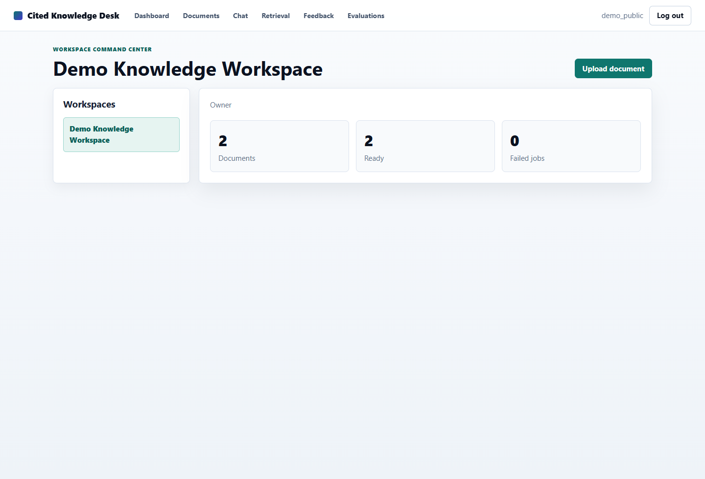
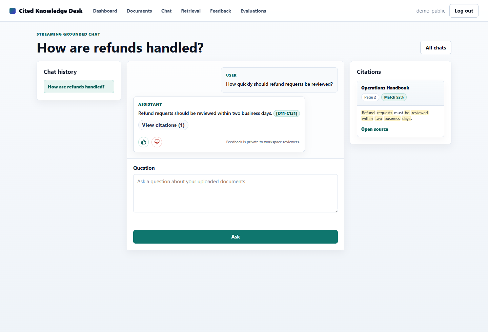
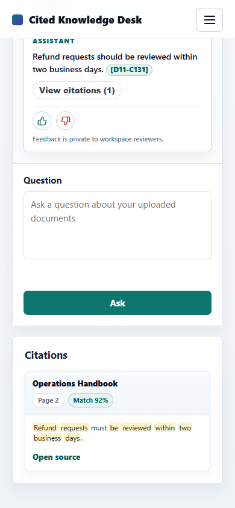
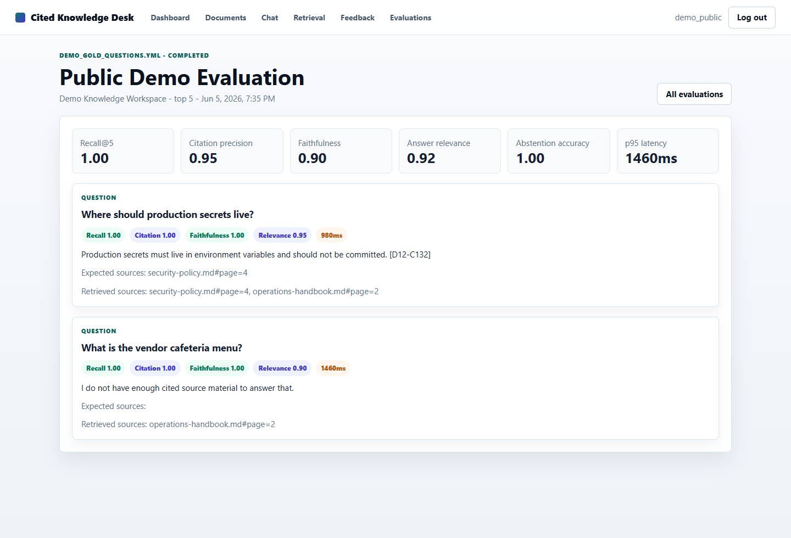

# Cited Knowledge Desk

[](https://github.com/Rehman-Maan/cited-knowledge-desk/actions/workflows/ci.yml)

Cited Knowledge Desk is a Django-based RAG workspace for asking questions over uploaded documents with grounded answers, source citations, feedback review, and evaluation metrics.

It is built for the trust problem behind document chat: answers are only useful when users can see where they came from, reviewers can flag weak responses, and teams can measure whether retrieval and citations are improving.

## Preview

### Workspace Dashboard



### Cited Chat



### Mobile Chat



### Evaluation Harness



## Highlights

- Workspace-scoped document library with PDF, Markdown, text, and DOCX upload validation
- Celery ingestion worker for text extraction and chunk creation
- pgvector-backed chunk embeddings with local deterministic embeddings for development
- OpenAI-compatible embedding and answer-generation providers
- Streaming Channels/WebSocket chat UI
- Persistent citations tied to source documents, chunks, pages, and match scores
- Citation excerpts that focus on the relevant source text instead of dumping whole chunks
- Answer feedback with thumbs-up/thumbs-down controls, optional comments, and review tags
- Workspace-admin feedback review queue
- Gold-question evaluation harness for recall, citation precision, faithfulness, relevance, abstention, and latency
- Guest demo mode with limited access to Dashboard, Documents, and Chat
- Production Docker Compose example with Django, Daphne, Celery, PostgreSQL/pgvector, and Redis
- GitHub Actions CI for linting, tests, migration checks, Docker build, and Trivy scanning

## Tech Stack

- Python 3.13
- Django 6
- Django Channels
- Django REST Framework
- Celery
- Redis
- PostgreSQL with pgvector
- Docker Compose
- OpenAI-compatible LLM and embedding integrations
- Playwright and pytest for testing

## Architecture

```text
Browser
  -> Django / Channels / Daphne
  -> PostgreSQL + pgvector
  -> Redis
  -> Celery workers
  -> Embedding provider
  -> LLM provider
```

The app keeps retrieval scoped to the active workspace, stores generated answers and citations, and records feedback/evaluation data for later review.

## Local Setup

Create a local environment file:

```powershell
Copy-Item .env.example .env
```

Create and activate a virtual environment:

```powershell
python -m venv .venv
.\.venv\Scripts\Activate.ps1
python -m pip install --upgrade pip
python -m pip install -e ".[dev]"
```

Start PostgreSQL and Redis:

```powershell
docker compose up -d db redis
```

Run migrations:

```powershell
python manage.py migrate
```

Run the Django app:

```powershell
python manage.py runserver
```

Run Celery in another terminal:

```powershell
celery -A config worker --loglevel=info --pool=solo
```

Open:

- App: <http://localhost:8000/>
- Signup: <http://localhost:8000/accounts/signup/>
- Login: <http://localhost:8000/accounts/login/>
- Health check: <http://localhost:8000/health/>
- Documents: <http://localhost:8000/documents/>
- Chat: <http://localhost:8000/chat/>
- Evaluations: <http://localhost:8000/evaluations/>

You can also start the full stack with Docker:

```powershell
docker compose up --build
```

## OpenAI Configuration

Local development can run with deterministic local providers. To use OpenAI-backed embeddings and answers, set these values in `.env`:

```powershell
EMBEDDING_PROVIDER=openai
EMBEDDING_MODEL=text-embedding-3-small
EMBEDDING_DIMENSIONS=1536
OPENAI_API_KEY=your-api-key

LLM_PROVIDER=openai
LLM_MODEL=gpt-5-mini
LLM_MAX_OUTPUT_TOKENS=700
```

Backfill vectors for existing chunks:

```powershell
python manage.py embed_missing_chunks
```

## Evaluation

The evaluation harness reads gold questions from `eval/gold_questions.yml`, runs retrieval and answer generation, then stores aggregate and per-question metrics.

Run from the UI:

- <http://localhost:8000/evaluations/>

Run from the terminal:

```powershell
python manage.py run_rag_eval --workspace your-workspace-slug --user your-username --dataset eval/gold_questions.yml --top-k 8
```

Tracked metrics:

- Retrieval recall@k
- Citation precision
- Faithfulness
- Answer relevance
- Abstention accuracy
- Average, p50, and p95 latency

## Testing

```powershell
python -m ruff check .
python manage.py check
python manage.py makemigrations --check --dry-run
python -m pytest
docker build --progress=plain -t cited-knowledge-desk:release .
```

CI runs the same core checks on GitHub Actions.

## Deployment

Production-oriented files are included:

- `.env.production.example`
- `Dockerfile`
- `docker-compose.prod.yml`
- `render.yaml`
- `docs/deployment.md`
- `docs/render-free-deployment.md`
- `docs/release-checklist.md`

The recommended deployment path is a small VPS running Docker Compose with:

- Django/Daphne web container
- Celery worker
- PostgreSQL/pgvector volume
- Redis volume
- Reverse proxy with HTTPS

See [docs/deployment.md](docs/deployment.md) for the full deployment notes.

For a no-cost portfolio preview, see [docs/render-free-deployment.md](docs/render-free-deployment.md).

## Security Notes

- Real `.env` files are ignored by Git
- Uploaded media is ignored by Git
- Workspace permissions scope documents, chat sessions, retrieval, feedback, and evaluations
- Guest mode is intentionally limited to Dashboard, Documents, and Chat
- Secrets must live in environment variables in production

See [docs/security.md](docs/security.md).

## Project Status

The core milestone build is complete:

1. Project setup
2. Auth and workspaces
3. Document upload
4. Ingestion worker
5. Embeddings and retrieval
6. Chat backend
7. Streaming chat UI
8. Feedback and review
9. Evaluation harness
10. Testing, CI, and deployment foundation

Milestone logs are stored in [docs/milestone-logs](docs/milestone-logs).

## License

See [LICENSE](LICENSE).
